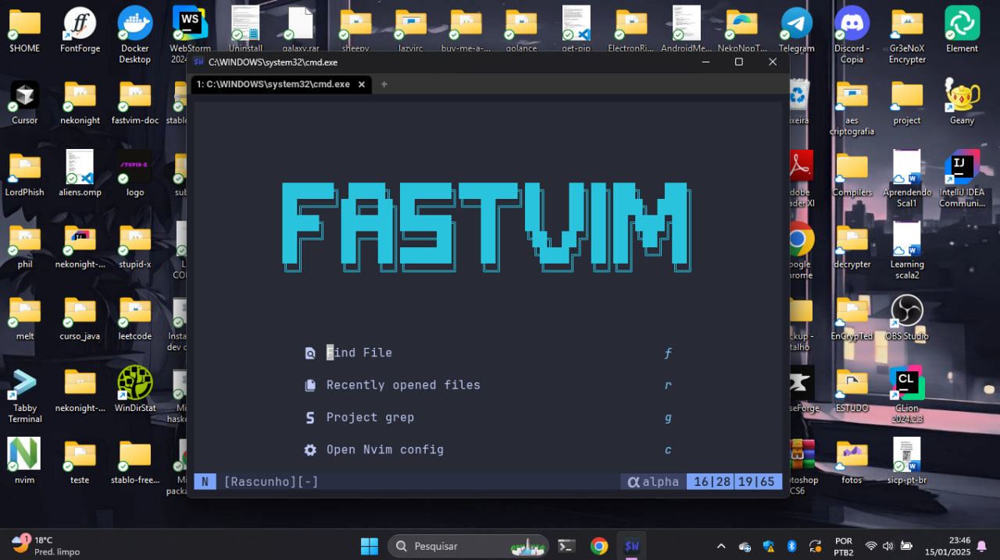
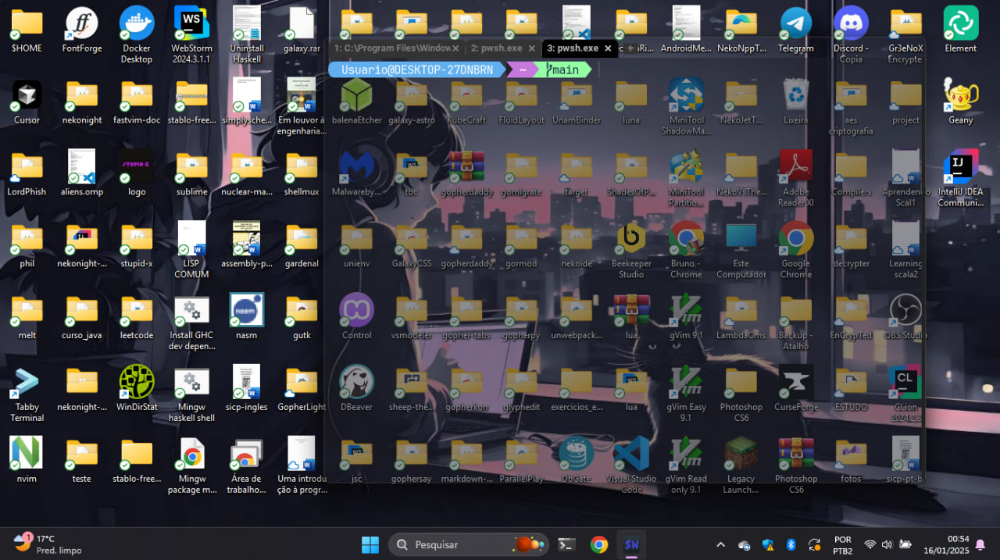
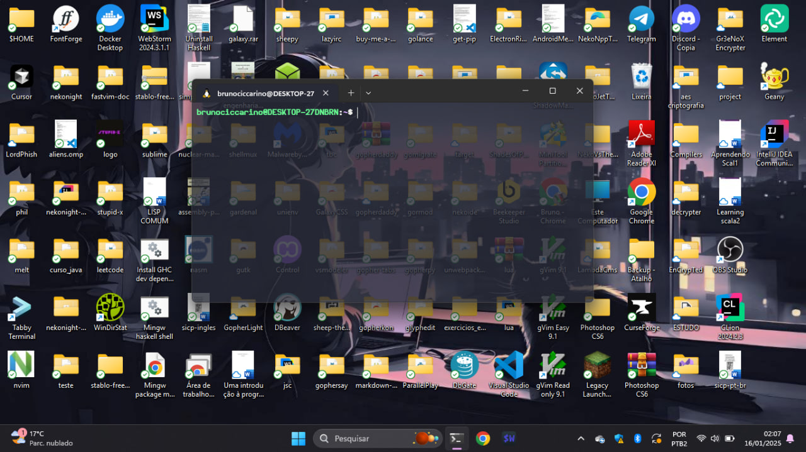

# dotfiles

these are my personal dotfiles, with my .bashrc, the fastvim distro which is derived from my personal neovim configuration, my wezterm config and my emacs config.

## Requirements

- Neovim >= **0.10.3** (needs to be built with **LuaJIT**)
- Git >= **2.19.0** (for partial clones support)
- [FastVim](https://github.com/fastvim/fastvim)
- a [Nerd Font](https://www.nerdfonts.com/)(v3.0 or greater) **_(optional, but needed to display some icons)_**
- a **C** compiler for `nvim-treesitter`. See [here](https://github.com/nvim-treesitter/nvim-treesitter#requirements)
- for [telescope.nvim](https://github.com/nvim-telescope/telescope.nvim) **_(optional)_**
    - **live grep**: [ripgrep](https://github.com/BurntSushi/ripgrep)
    - **find files**: [fd](https://github.com/sharkdp/fd)
- a terminal that support true color and _undercurl_:
    - [wezterm](https://github.com/wez/wezterm) **_(Linux, Macos & Windows)_**
    - [alacritty](https://github.com/alacritty/alacritty) **_(Linux, Macos & Windows)_**
    - [iterm2](https://iterm2.com/) **_(Macos)_**
- [nekonight](https://github.com/BrunoCiccarino/nekonight)
- [YouCompleteMe](https://github.com/ycm-core/YouCompleteMe)
- [npm](https://www.npmjs.com/) **for vim-prettier**

### Details

- Terminal: **wezterm**
- Text editor: **neovim**
- Shell: **zsh/powershell**

### Why Vim?

First off, why am I even using Vim in 2025 when there are IDEs like VSCode that come with all the bells and whistles? Simple: **speed** and **focus**. Vim is like that old reliable friend who’s always there for you, doesn’t crash, and doesn’t hog your RAM. Sure, it takes some time to get used to, but once you do, there’s no going back.

Before we dive into my Vim config, let me introduce you to my terminal emulator of choice: **WezTerm**. This is hands-down the best terminal I’ve used on Windows. It’s fast, super customizable, and feels snappy as hell. No disrespect to Windows Terminal or other options, but WezTerm just _clicked_ for me. It’s perfect for running Vim, Git, Node.js, and whatever else I throw at it.
